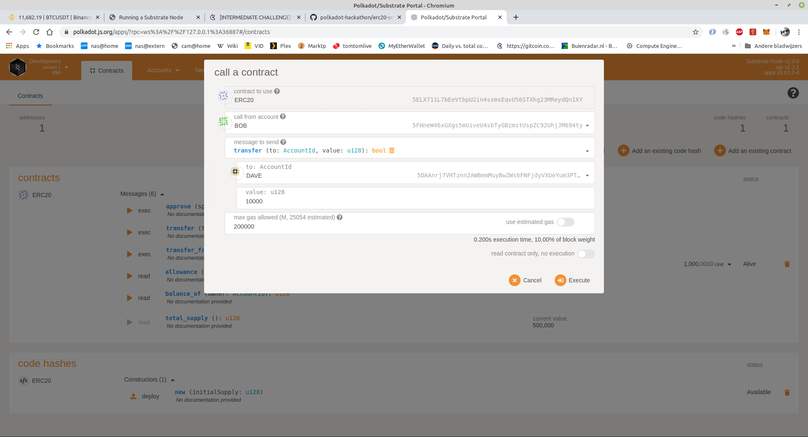
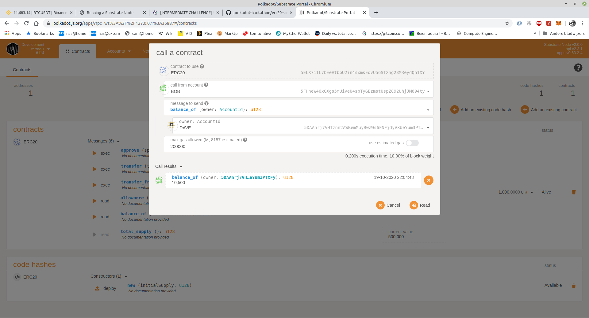

# [INTERMEDIATE CHALLENGE] Smart contracts - write an ERC-20 smart contract with ink!

* Link to the Substrate node I created that includes the contracts pallet repo [here](https://github.com/developery-nl/polkadot_challenge_substrate_node_contract)
* I did use the ERC-20 contract from [ink example](https://github.com/paritytech/ink/tree/master/examples/erc20)

My workflow:
1. Run the substrate node with contracts pallet, the code I used can be found [here](https://github.com/developery-nl/polkadot_challenge_substrate_node_contract) 
2. Open the the [polkadot app](https://polkadot.js.org/apps/#/contracts).
3. Upload WASM ( erc20.wasm ) and contract ABI ( metadata.json )
4. Deploy Contract.
5. Execute calls on the contract to show it is working with transfer calls and balance calls.

## Some proofs

